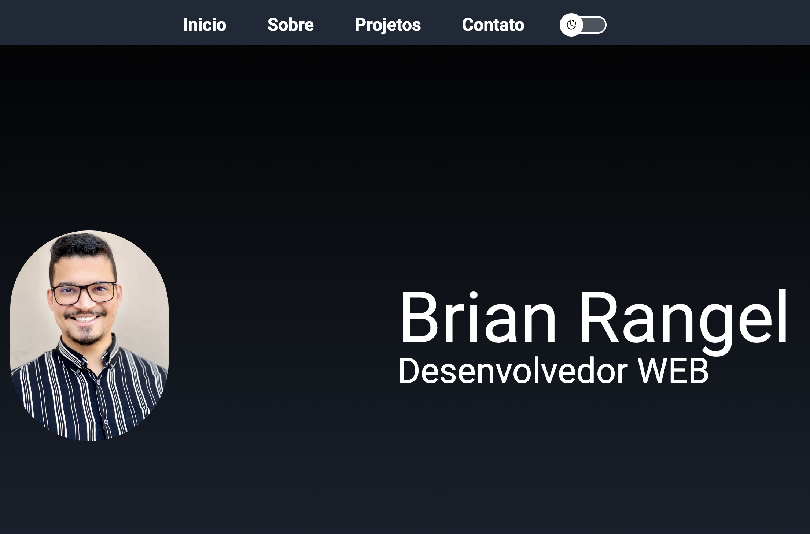

<h1 align="center"> Portfolio </h1>

  <a href="#-tecnologias">Tecnologias</a>&nbsp;&nbsp;&nbsp;|&nbsp;&nbsp;&nbsp;
  <a href="#-projeto">Projeto</a>&nbsp;&nbsp;&nbsp;|&nbsp;&nbsp;&nbsp;

 

  

## 🚀 Tecnologias

Esse projeto foi desenvolvido com as seguintes tecnologias:

- HTML e TailwindCSS
- TypeScript
- React
- Git e Github

## 💻 Projeto

O site portifolio

- [Acesse o projeto finalizado, online](https://portifolio-brian.vercel.app)

Feito com ♥ by Brian